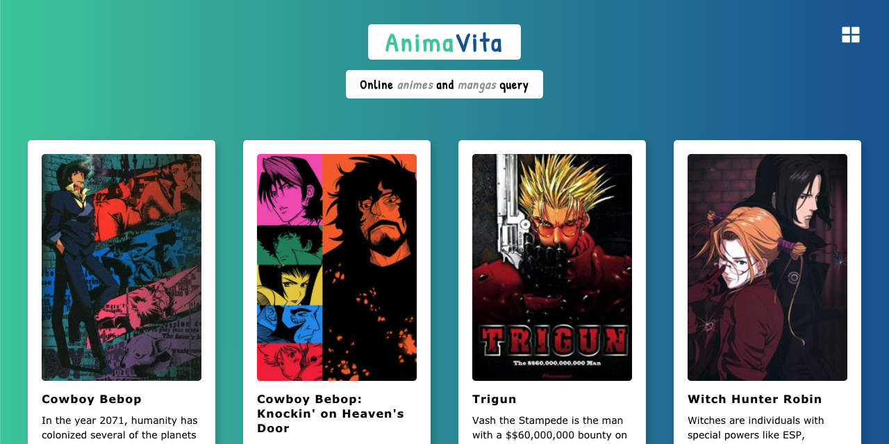

# AnimaVita

Consultas online com animes e mangás desenvolvido em ReactJS.
[Visualizar Projeto](http://caueamaral.github.io/anima-vita).



## Criado com ReactJS
- useState()
- useEffetc()
- Axios
- Styled Components

### Visualizar

1 - Instale as dependências com:

```sh
npm install
```

2 - Inicialize o servidor de desenvolvimento:

```sh
npm start
```